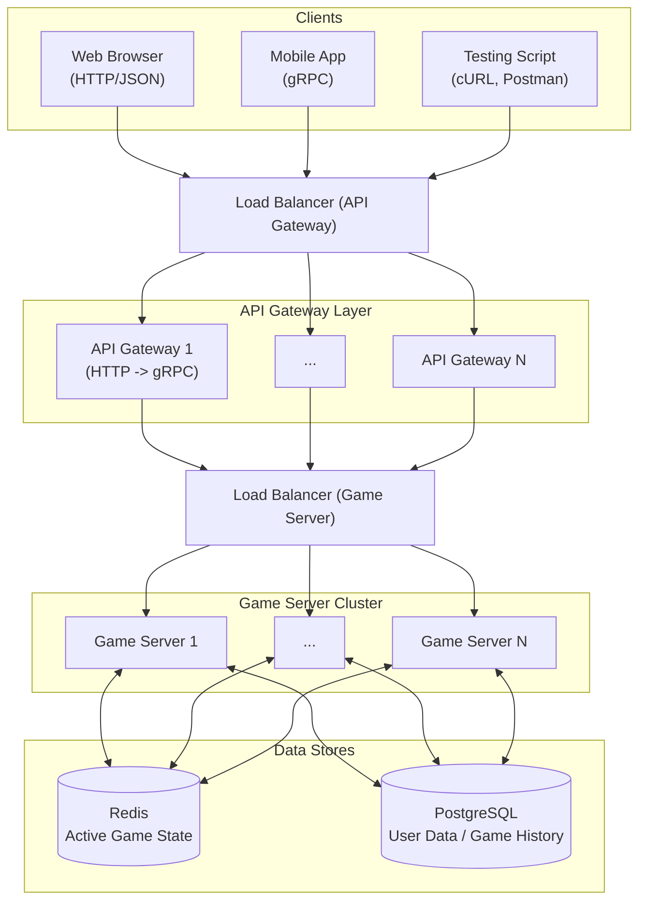
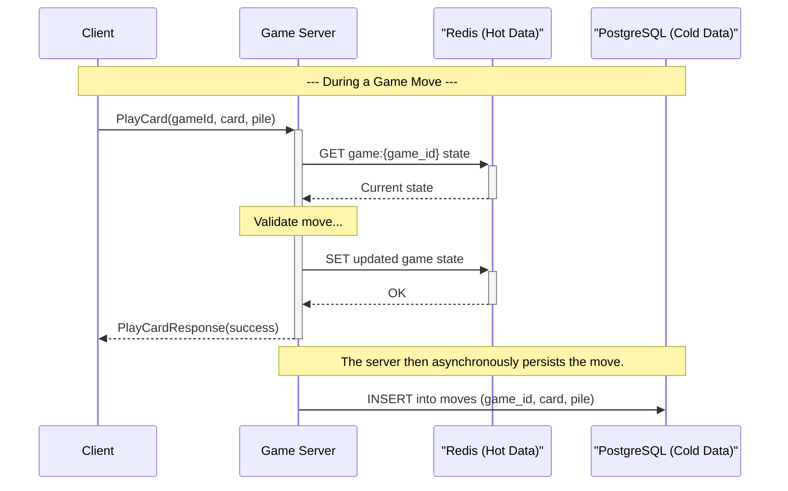

# Design Document: The Game Online

## 1. Overview

This document outlines the architecture and design for a real-time, multiplayer online version of "The Game". The primary goal is to create a scalable and resilient backend system capable of supporting tens of thousands of concurrent players. The design emphasizes a modular, layered architecture with stateless application servers to allow for easy horizontal scaling.

## 2. High-Level Architecture

The system is designed as a set of distributed components, with a clear separation of concerns between handling game logic, managing state, and communicating with clients.



### Components:

- **Clients:** Can be any mix of gRPC-native clients (like a mobile app) or standard HTTP clients (like a web browser or testing tools).
- **Load Balancer:** Distributes incoming traffic across the API Gateway instances.
- **API Gateway:** A cluster of reverse-proxies that translate RESTful HTTP/JSON requests into gRPC requests. This allows web clients to interact with the backend. It also passes direct gRPC traffic through to the game servers.
- **Game Server Cluster:** A group of identical, stateless Go application servers that _only_ speak gRPC. They are responsible for all game logic.
- **Data Stores:**
  - **Redis (Cache):** For active game state.
  - **PostgreSQL (Persistent Storage):** For user data and game history.

## 3. Detailed Design

### 3.1. Stateless Server Philosophy

The core principle of this design is that the **Game Servers are stateless**. This means no game state is ever stored in the memory of a server instance between requests. After handling a request, the server writes any state changes to Redis.

This has a key advantage for scalability:

- **Horizontal Scaling:** We can add or remove server instances from the cluster at any time without disrupting active games.
- **Resilience:** If a server instance crashes, the load balancer will redirect its traffic to healthy instances. Since the state is in Redis, another server can immediately pick up where the last one left off.

### 3.2. Data Model (Redis)

We will use Redis to store the state of all ongoing games.

- **Game State:** A Redis Hash for each game.
  - `game:{game_id}` -> `{ "players": ["p1", "p2"], "pile_asc_1": 1, "pile_asc_2": 1, "pile_desc_1": 100, "pile_desc_2": 100, ... }`
- **Player Hand:** A Redis Set for each player's hand in a specific game.
  - `hand:{game_id}:{player_id}` -> `{2, 15, 33, 98, ...}`
- **Deck:** A Redis List or Set for the deck of the remaining cards.
  - `deck:{game_id}` -> `[3, 4, 5, ...]`

### 3.3. API Design (gRPC & HTTP)

The gRPC `GameService` will be the single source of truth. We will add annotations to the `.proto` file to define how the gRPC methods map to HTTP/JSON endpoints. The gRPC-Gateway will use these annotations to generate the reverse-proxy.

```proto
import "google/api/annotations.proto";

service GameService {
    // Creates a new game lobby
    rpc CreateGame(CreateGameRequest) returns (CreateGameResponse) {
        option (google.api.http) = {
            post: "/v1/games"
            body: "*"
        };
    }

    // Allows a player to join an existing game
    rpc JoinGame(JoinGameRequest) returns (JoinGameResponse) {
        option (google.api.http) = {
            post: "/v1/games/{game_id}/join"
            body: "*"
        };
    }

    // Streams real-time game state updates to a client (via WebSocket)
    rpc StreamGameState(StreamGameStateRequest) returns (stream GameStateResponse);

    // Allows a player to play a card
    rpc PlayCard(PlayCardRequest) returns (PlayCardResponse) {
        option (google.api.http) = {
            post: "/v1/games/{game_id}/play"
            body: "*"
        };
    }
}
```

When we compile the proto, it will generate both the gRPC server code and the HTTP gateway code. The `StreamGameState` RPC is suitable for conversion to a WebSocket connection by the gateway for real-time communication with web browsers.

### 3.4. Data Flow Example

To ensure low latency for players and resilience for the system, game state modifications are handled in a specific order. The immediate game state is updated in Redis, a response is sent to the client, and then the move is persisted asynchronously to PostgreSQL. This ensures that the client is not kept waiting for the database write to complete.

This approach also supports stateless server instances. Since all state is managed in Redis (hot) and PostgreSQL (cold), any server instance can handle any client request.

Here is a sequence diagram illustrating this flow for a single card play:


